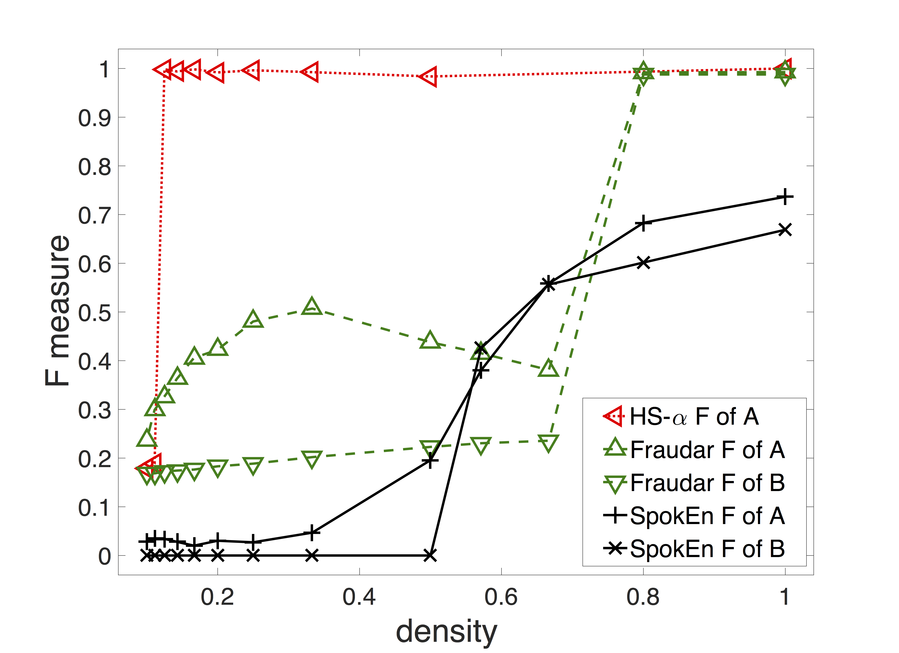
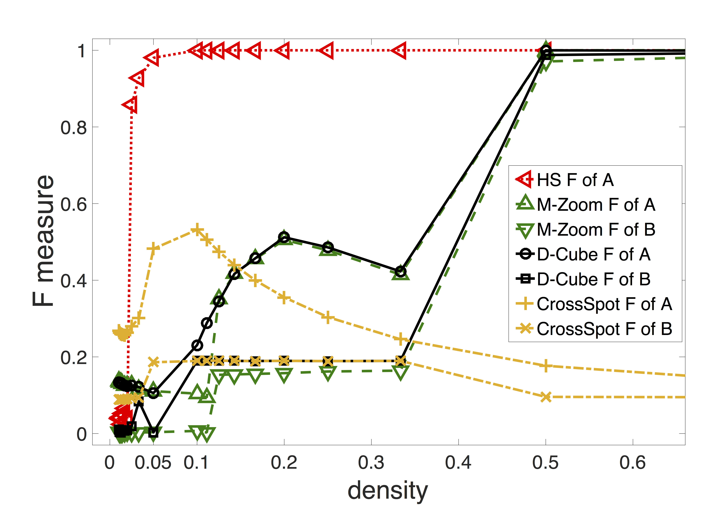
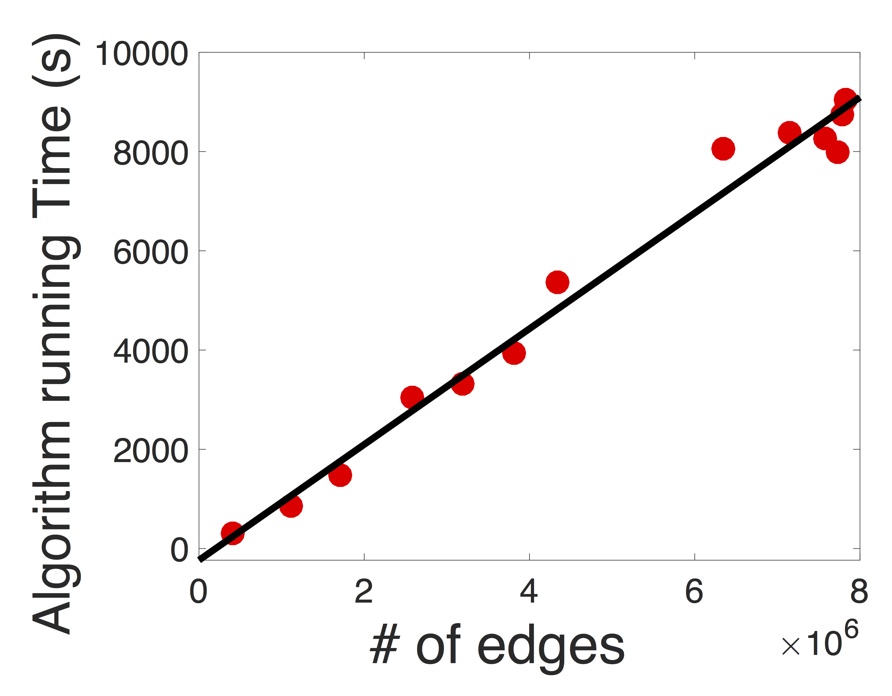

HoloScope
======
**HoloScope**: Topology-and-Spike Aware Fraud Detection

**HoloScope** is developped for fraud detection based on graphs, which makes *holistic*
	use of several signals, namely connectivity (i.e., topology), temporal bursts and drops,
	and rating deviation in a systematic way.

Abstract:
------

As online fraudsters invest more resources, including purchasing large pools of fake user accounts and dedicated IPs, fraudulent attacks become less obvious and their detection becomes increasingly challenging. Existing approaches such as average degree maximization suffer from the bias of including more nodes than necessary, resulting in lower accuracy and increased need for manual verification. Hence, we propose HoloScope, which uses information from graph topology and temporal spikes to more accurately detect groups of fraudulent users. In terms of graph topology, we introduce *contrast suspiciousness*, a dynamic weighting approach, which allows us to more accurately detect fraudulent blocks, particularly low-density blocks. In terms of temporal spikes, HoloScope takes into account the sudden bursts and drops of fraudsters' attacking patterns. In addition, we provide theoretical bounds for how much this increases the time cost needed for fraudsters to conduct adversarial attacks. Additionally, from the perspective of ratings, HoloScope incorporates the deviation of rating scores in order to catch fraudsters more accurately. Moreover, HoloScope has a concise framework and sub-quadratic time complexity, making the algorithm reproducible and scalable. Extensive experiments showed that HoloScope achieved significant accuracy improvements on synthetic and real data, compared with state-of-the-art fraud detection methods. 

Run in command line:
------
```bash
python run_holoscope.py #default run demo 0 which is synthetic data

python run_holoscope.py -r 1 -K 1 #run demo 1 which is yelp data with injected labels, and return block 1

python run_holoscope.py --help

usage: run_holoscope.py [-h] [-r {0,1,2}] [-K NBLOCK] [-p OUTPATH] [-t] [-s]
                        [path] [rootnm]

positional arguments:
  path                  the path of input data
  rootnm                the root name of input files, including *.edgelist,
                        *ts.dict for time series, *rate.dict for rating. e.g.
                        yelp.edgelist[.gz], yelpts.dict[.gz],
                        yelprate.dict[.gz]

optional arguments:
  -h, --help            show this help message and exit
  -r {0,1,2}, --run {0,1,2}
                        choose which way to run (default:0). 0 and 1 are demo
                        run; 2 run for user's input case
  -K NBLOCK, --nblock NBLOCK
                        choose number of blocks to detect (default:1).
  -p OUTPATH, --outpath OUTPATH
                        choose number of blocks to detect
                        (default:./testout/).
  -t                    consider time series. Need *ts.dict[.gz] file
  -s                    consider rating scores. Need *rate.dict[.gz] file

  example: 
     python run_holoscope.py ./testdata/ yelp -tsr 2

```

API Usage:
------
Interface of holoscopeFraudDect.py
```python
def HoloScope(wmat, alg, ptype, qfun, b, ratefile=None, tsfile=None,
              tunit='s', numSing=10, nblock=1):
    '''
    The interface of HoloScope algorithm for external use
    Parameters
    ----------
    wmat: str or sparse matrix
        If it is str, wmat is the input file name. We load the file into sparse
        matrix. The format of file is edge list, i.e. 'u1 v1\n' for each line. 
	If it is sparse matrix, we just use wmat.
    alg: str
        which algorithm you are going to use. You can choose 'greedy' for
        synthetic data (#rows+#cols<10000); or 'fastgreedy' for any size of data
        sets.
    ptype: list
        contains which attributes the algorithm is going to use. The hololisc
        use of all siginals is [Ptype.freq, Ptype.ts, Ptype.rate]
    qfun: str
        which kind of qfun the algorithm uses, choosing from 'exp' for
        exponential (recommended), 'pl' for power-law, 'lin' for linear
    b: float
        The base of exponetial qfun, or the exponent of power-law qfun, or
        absolute slope of linear qfun
    ratefile: str or None
        The file name with path for user-object rating sequences. The file
        format is that each line looks like 'userid-objectid:#star1 #star2 ...\n'
    tsfile: str or None
        The file name with path for user-object timestamp sequences. The file
        format is that each line looks like 'userid-objectid:t1 t2 ...\n'
    tunit: str (only support 's' or 'd') or None
        The time unit of input time
        e.g. in amazon and yelp data, the time is date, i.e. tunit='d'.
             We use # of days (integer) from the earlest date as input
    numSing: int
        The number of first left singular vectors used in our algorithm
    nblock: int
        The number of block we need from the algorithm
    Return
    ---------
    (gbestvx, (gsrows, gbscores)), opt
        Block (gsrows, gbscores) has the best objective values *gbestvx* among 
	*nblock* blocks.
        gbestvx: float
            the best objective value of the *nblock* blocks.
        gsrows: list
            is the list of suspicious rows.
        gbscores: list
            is the suspicoius scores for every objects. The index is object id,
            and value is the score. With the scores, you can get the suspicious rank
	    of the objects.
        opt: instance of HoloScopeOpt class
            the class instance which contains all the *nblock* blocks in opt.nbests.
            opt.nbests: list
                This is the list contains *nblock* solutions in the form of
                tuple, i.e., (opt.bestvx, (srows, bscores))
    '''
```

The results:
------
<p align="center">
  
  
  
  
</p>

Cite:
------
```latex
@inproceedings{liu2017holoscope,
  author    = {Shenghua Liu and
               Bryan Hooi and
               Christos Faloutsos},
  title     = {HoloScope: Topology-and-Spike Aware Fraud Detection},
  booktitle = {Proceedings of the 2017 {ACM} on Conference on Information and Knowledge
               Management, {CIKM} 2017, Singapore, November 06 - 10, 2017},
  pages     = {1539--1548},
  year      = {2017},
  crossref  = {DBLP:conf/cikm/2017},
  url       = {http://doi.acm.org/10.1145/3132847.3133018},
  doi       = {10.1145/3132847.3133018},
  timestamp = {Tue, 07 Nov 2017 16:24:37 +0100},
  biburl    = {http://dblp.org/rec/bib/conf/cikm/LiuHF17},
  bibsource = {dblp computer science bibliography, http://dblp.org}
}
@article{liu2018contrast,
  title={A Contrast Metric for Fraud Detection in Rich Graphs},
  author={Liu, Shenghua and Hooi, Bryan and Faloutsos, Christos},
  journal={IEEE Transactions on Knowledge and Data Engineering},
  year={2018},
  publisher={IEEE}
}
```
